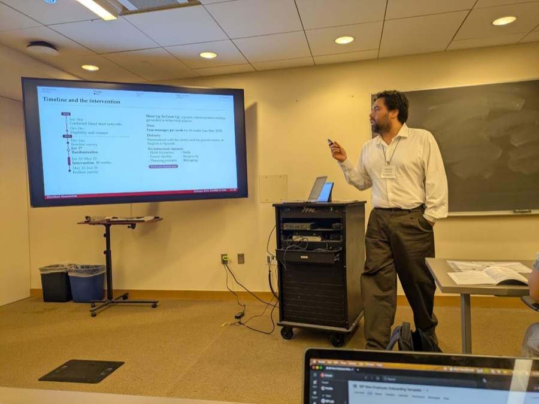
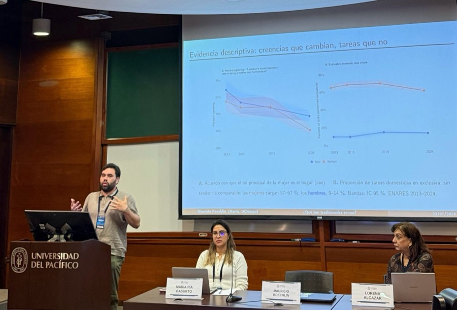
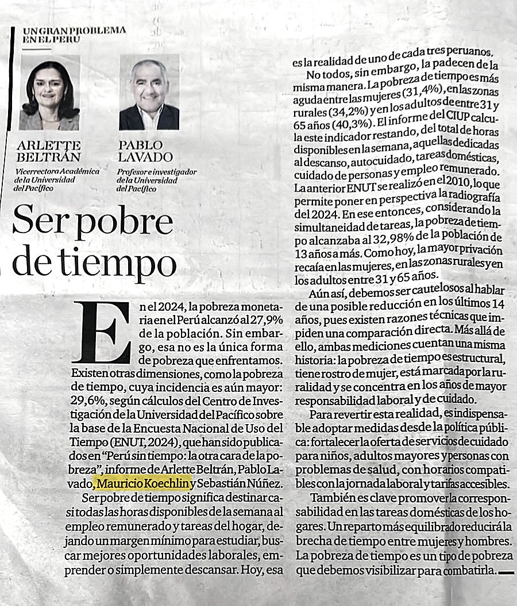

::: {.hero-grid}

::: {.hero-main}

{.avatar}

::: {.card-panel}
## Hola, I'm Mauricio

I'm an economist from Lima, Peru 🇵🇪, currently a Pre-doctoral Research
Professional at the [Behavioral Insights and Parenting Lab](https://biplab.uchicago.edu/)
at the University of Chicago, where I work with
[Ariel Kalil](https://harris.uchicago.edu/directory/ariel-kalil).

This site is where I keep some of my work, the projects I'm in the middle of and the
half-finished ideas I want to come back to. Have a look around.

::: {.btn-row}
[Download CV](cv/Koechlin_CV.pdf){.btn-main target="_blank"}
[Email me](mailto:mkoechlin@uchicago.edu){.btn-ghost}
:::
:::

::: {.card-panel}
## Research Fields

Gender and the Labor Market · Family Economics · Economics of Education

[See all research →](research.qmd)
:::

::: {.card-panel}
## Consulting and Applied Research

I have also worked on applied economics: impact evaluation, reproducibility auditing
and regulatory analysis for multilateral organizations, governments and private firms
across five countries in Latin America.

<svg viewBox="0 0 300 291" xmlns="http://www.w3.org/2000/svg" class="map" role="img" aria-label="Latin American countries where I have worked"><g fill="rgba(255,255,255,0.08)" stroke="rgba(255,255,255,0.15)" stroke-width="0.5"><path d="M-26.5,-29.7L-26.5,-29.7L-26.5,-29.7L-26.5,-29.7L-26.5,-29.7L-26.5,-29.7L-17.9,-29.7L-4.6,-29.7L10.4,-29.7L25.5,-29.7L34.6,-29.7L34.6,-29.7L36.1,-29.7L36.9,-29.7L38.3,-29.7L41.3,-29.7L45.8,-29.7L50.1,-29.7L53.7,-29.7L59.1,-29.7L60.6,-29.7L64.5,-29.7L68.6,-29.7L73.0,-29.7L76.5,-29.7L80.0,-29.7L80.4,-29.7L81.4,-29.7L81.2,-29.7L82.3,-29.7L83.2,-29.7L83.4,-29.7L84.3,-29.7L85.5,-29.7L86.2,-29.7L85.6,-29.7L90.2,-29.7L91.2,-29.7L92.0,-29.7L90.7,-29.7L88.7,-29.7L87.7,-29.7L87.6,-29.7L88.1,-29.7L89.6,-29.7L90.7,-29.7L95.8,-29.7L100.4,-29.7L106.1,-29.7L106.2,-29.7L105.8,-29.7L105.1,-29.7L107.1,-29.7L111.5,-29.7L115.5,-29.7L116.9,-29.7L117.5,-29.7L122.1,-29.7L124.1,-29.7L130.8,-29.7L138.9,-29.7L139.4,-29.7L140.8,-29.7L142.7,-29.7L144.2,-29.7L145.6,-29.7L149.0,-29.7L150.4,-29.7L153.4,-29.7L155.3,-29.7L155.3,-29.7L158.2,-29.7L159.0,-29.7L154.3,-29.7L149.7,-29.7L145.1,-29.7L142.7,-29.7L142.0,-29.7L141.9,-29.7L143.4,-29.7L145.2,-29.7L144.8,-29.7L146.1,-29.7L145.7,-29.7L142.8,-29.7L140.6,-29.7L137.4,-29.7L135.5,-29.7L132.9,-29.7L129.2,-29.7L135.7,-29.7L137.0,-29.7L130.8,-29.7L128.0,-29.7L128.2,-29.7L126.8,-29.7L128.1,-29.7L127.2,-29.7L123.9,-29.7L123.6,-29.7L122.6,-29.7L121.2,-29.7L122.1,-29.7L123.2,-29.7L123.3,-29.7L121.9,-29.7L119.4,-29.7L119.0,-29.7L120.3,-29.7L118.1,-29.7L117.6,-29.7L116.7,-29.7L117.7,-29.7L114.8,-29.7L117.8,-29.7L118.0,-29.7L119.2,-29.7L119.7,-29.7L120.3,-29.7L117.5,-29.7L113.0,-29.7L110.1,-29.7L107.8,-29.7L105.6,-29.7L105.0,-29.7L100.1,-29.7L97.7,-29.7L95.6,-29.7L94.9,-29.7L95.7,-29.7L97.1,-25.6L99.1,-22.0L99.1,-19.8L101.2,-14.1L101.1,-10.7L100.9,-8.8L99.8,-5.9L98.5,-5.2L96.3,-5.8L95.6,-8.0L93.9,-9.1L91.6,-13.3L89.5,-17.1L88.9,-19.1L89.8,-22.4L88.5,-25.2L85.1,-29.4L83.4,-29.7L78.9,-27.9L78.1,-28.1L76.0,-29.7L73.2,-29.7L68.2,-29.7L64.3,-29.7L61.0,-29.7L59.1,-29.7L59.9,-29.2L59.9,-27.1L60.8,-26.1L60.0,-25.5L58.3,-26.2L56.7,-25.3L53.5,-25.4L50.2,-28.1L46.3,-27.5L43.1,-28.6L40.4,-28.3L36.7,-27.1L32.6,-23.3L28.3,-21.2L25.9,-18.8L24.8,-16.6L24.8,-13.1L25.0,-10.8L25.9,-9.1L24.1,-9.0L21.0,-10.0L17.6,-11.6L16.3,-13.9L15.4,-17.3L12.8,-20.2L11.2,-23.1L9.0,-26.6L5.9,-28.6L2.3,-28.5L-0.5,-24.5L-4.1,-26.0L-6.4,-27.6L-7.5,-29.7L-9.0,-29.7L-11.6,-29.7L-13.9,-29.7L-15.5,-29.7L-23.1,-29.7L-23.1,-29.7L-26.5,-29.7L-26.5,-29.7L-26.5,-29.7L-26.5,-29.7L-26.5,-29.7L-26.5,-29.7L-26.5,-29.7L-26.5,-29.7L-26.5,-29.7L-26.5,-29.7L-26.5,-29.7L-26.5,-29.7L-26.5,-29.7L-26.5,-29.7L-26.5,-29.7L-26.5,-29.7L-26.5,-29.7L-26.5,-29.7L-26.5,-29.7L-26.5,-29.7L-26.5,-29.7L-26.5,-29.7L-26.5,-29.7L-26.5,-29.7L-26.5,-29.7L-26.5,-29.7L-26.5,-29.7L-26.5,-29.7L-26.5,-29.7L-26.5,-29.7L-26.5,-29.7L-26.5,-29.7L-26.5,-29.7L-26.5,-29.7L-26.5,-29.7L-26.5,-29.7L-26.5,-29.7L-26.5,-29.7Z"/><path d="M200.2,249.1L199.1,253.2L197.9,258.5L197.9,263.7L197.0,264.9L196.6,268.3L196.3,271.1L201.9,275.7L201.3,279.4L204.1,281.8L203.9,284.5L199.6,291.6L193.1,294.7L184.2,295.8L179.4,295.3L180.3,298.7L179.4,303.0L180.2,305.9L177.6,307.9L173.1,308.7L168.8,306.6L167.1,308.1L167.7,314.0L170.7,315.8L173.1,313.9L174.4,317.0L170.4,318.9L166.8,322.6L166.2,325.7L165.2,325.7L161.0,325.7L157.5,325.7L156.3,325.7L160.6,325.7L164.8,325.7L163.3,325.7L158.1,325.7L155.2,325.7L151.2,325.7L149.4,325.7L150.8,325.7L153.8,325.7L151.9,325.7L147.8,325.7L137.1,325.7L135.3,325.7L135.4,325.7L132.5,325.7L130.9,325.7L130.5,325.7L133.9,325.7L135.3,325.7L134.8,325.7L137.1,325.7L138.7,325.7L138.3,325.7L140.2,325.7L139.7,325.7L137.7,325.7L139.1,324.4L137.1,322.1L136.1,315.2L137.9,314.0L137.1,306.8L138.2,300.9L139.4,295.8L142.0,293.7L140.7,288.2L140.6,283.2L144.0,279.6L143.9,275.1L146.4,269.8L146.4,264.9L145.3,264.0L143.2,255.0L145.9,249.7L145.5,244.8L147.1,240.2L150.0,235.5L153.1,232.4L151.8,230.5L152.7,228.9L152.6,220.8L157.4,218.4L158.9,213.4L158.4,212.2L162.0,207.9L167.8,209.0L170.4,212.5L172.1,208.6L177.1,208.8L177.9,209.8L186.0,217.7L189.6,218.4L195.0,222.0L199.5,223.9L200.1,226.0L195.8,233.5L200.3,234.9L205.2,235.6L208.7,234.8L212.7,231.0L213.4,226.7L215.6,225.8L217.8,228.6L217.7,232.5L214.0,235.3L211.0,237.3L206.1,242.2L200.2,249.1Z"/><path d="M147.4,187.9L149.6,191.1L150.1,194.4L152.5,196.4L151.1,201.0L153.4,206.3L155.2,212.8L158.4,212.2L158.9,213.4L157.4,218.4L152.6,220.8L152.7,228.9L151.8,230.5L153.1,232.4L150.0,235.5L147.1,240.2L145.5,244.8L145.9,249.7L143.2,255.0L145.3,264.0L146.4,264.9L146.4,269.8L143.9,275.1L144.0,279.6L140.6,283.2L140.7,288.2L142.0,293.7L139.4,295.8L138.2,300.9L137.1,306.8L137.9,314.0L136.1,315.2L137.1,322.1L139.1,324.4L137.7,325.7L139.7,325.7L140.2,325.7L138.3,325.7L138.7,325.7L137.1,325.7L134.8,325.7L135.3,325.7L133.9,325.7L130.5,325.7L130.9,325.7L132.5,325.7L135.4,325.7L135.3,325.7L137.1,325.7L147.8,325.7L151.9,325.7L148.0,325.7L145.8,325.7L141.9,325.7L141.1,325.7L139.3,325.7L134.3,325.7L129.3,325.7L129.3,325.7L123.8,325.7L122.4,325.7L123.6,325.7L121.4,325.7L120.8,325.7L122.7,325.7L127.4,325.7L120.7,325.7L124.9,325.7L126.4,325.7L131.3,325.7L133.6,315.9L130.6,314.4L129.3,321.9L126.5,321.0L127.9,312.4L129.4,301.6L131.4,297.7L130.1,292.2L129.8,285.9L131.6,285.7L134.3,276.9L137.4,268.3L139.2,260.5L138.2,252.7L139.5,248.5L139.0,242.2L141.6,236.1L142.4,226.5L143.8,216.5L145.2,205.8L144.9,198.1L143.9,191.5L146.2,190.3L147.4,187.9Z"/><path d="M138.0,20.4L138.4,22.9L138.1,24.7L137.0,25.5L138.1,26.9L138.1,28.2L135.1,27.4L133.0,27.7L130.3,27.4L128.3,28.2L125.9,26.8L126.3,25.3L130.4,25.9L133.7,26.3L135.3,25.3L133.3,23.2L133.3,21.5L130.5,20.7L131.5,19.4L134.2,19.6L138.0,20.4Z"/><path d="M138.1,28.2L138.1,26.9L137.0,25.5L138.1,24.7L138.4,22.9L138.0,20.4L138.6,19.6L142.0,19.6L144.6,20.8L145.8,20.7L146.6,22.3L149.0,22.3L148.9,23.6L150.8,23.8L153.0,25.5L151.4,27.4L149.3,26.4L147.2,26.6L145.8,26.4L145.0,27.2L143.3,27.5L142.6,26.4L141.2,27.1L139.4,30.2L138.3,29.5L138.1,28.2Z"/><path d="M106.0,-13.6L108.0,-14.0L111.0,-13.9L111.1,-12.6L106.3,-11.8L106.0,-13.6Z"/><path d="M111.2,-14.9L114.7,-12.6L113.9,-9.1L113.1,-9.8L113.2,-12.3L111.2,-14.3L111.2,-14.9Z"/><path d="M109.5,-5.9L110.8,-5.7L112.3,-1.6L112.3,1.2L111.3,1.4L110.1,-1.4L108.5,-2.8L109.5,-5.9Z"/><path d="M-26.5,-29.7L-26.5,-29.7L-26.5,-29.7L-26.5,-29.7L-26.5,-29.7L-26.5,-29.7L-26.5,-29.7L-23.1,-29.7L-23.1,-29.7L-15.5,-29.7L-13.9,-29.7L-11.6,-29.7L-9.0,-29.7L-7.5,-29.7L-6.4,-27.6L-4.1,-26.0L-0.5,-24.5L2.3,-28.5L5.9,-28.6L9.0,-26.6L11.2,-23.1L12.8,-20.2L15.4,-17.3L16.3,-13.9L17.6,-11.6L21.0,-10.0L24.1,-9.0L25.9,-9.1L24.1,-4.8L23.4,-1.3L23.0,5.1L22.6,7.5L23.4,10.1L24.8,12.4L25.6,16.0L28.6,19.5L29.6,22.2L31.3,24.5L36.0,25.8L37.8,27.7L41.7,26.4L45.1,25.9L48.4,25.1L51.1,24.3L53.9,22.4L55.0,19.7L55.4,15.7L56.1,14.3L59.1,13.1L63.8,12.0L67.7,12.2L70.4,11.8L71.4,12.8L71.3,15.0L68.9,17.8L67.8,20.7L68.7,21.5L68.0,23.5L66.9,27.2L65.8,26.0L64.9,26.0L64.0,26.1L62.4,28.9L61.6,28.4L61.1,28.6L61.1,29.3L57.1,29.2L52.9,29.2L52.9,31.8L50.9,31.8L52.6,33.4L54.2,34.4L54.7,35.4L55.4,35.7L55.3,37.3L49.6,37.3L47.5,41.0L48.1,41.9L47.6,43.0L47.5,44.3L42.5,39.4L40.3,37.9L36.7,36.7L34.2,37.0L30.6,38.7L28.4,39.2L25.3,38.0L22.0,37.1L17.9,35.0L14.6,34.4L9.6,32.2L5.9,30.0L4.8,28.8L2.3,28.5L-2.2,27.0L-4.0,24.9L-8.8,22.2L-11.0,19.3L-12.1,17.0L-10.6,16.5L-11.0,15.2L-10.0,14.0L-10.0,12.3L-11.5,10.2L-11.9,8.3L-13.4,5.9L-17.2,1.1L-21.7,-2.7L-23.8,-5.7L-26.5,-7.7L-26.5,-8.9L-26.5,-11.9L-26.5,-13.1L-26.5,-15.5L-26.5,-18.9L-26.5,-19.3L-26.5,-22.0L-26.5,-24.4L-26.5,-26.0L-26.5,-29.7L-26.5,-29.7L-26.5,-29.7L-26.5,-29.7L-26.5,-29.7L-26.5,-29.7L-26.5,-29.7L-26.5,-29.7L-26.5,-29.7L-26.5,-28.5L-26.5,-25.0L-26.5,-23.8L-26.5,-23.4L-26.5,-21.7L-26.5,-21.8L-26.5,-18.5L-26.5,-17.3L-26.5,-15.5L-26.5,-13.0L-26.5,-8.4L-26.5,-6.3L-26.5,-4.0L-26.5,-1.4L-26.5,-1.3L-26.5,0.9L-26.5,3.1L-26.5,3.9L-26.5,5.7L-26.5,5.7L-26.5,2.7L-26.5,-0.0L-26.5,-2.3L-26.5,-3.6L-26.5,-7.1L-26.5,-9.8L-26.5,-11.3L-26.5,-13.5L-26.5,-12.9L-26.5,-14.2L-26.5,-15.4L-26.5,-18.3L-26.5,-18.6L-26.5,-18.3L-26.5,-20.2L-26.5,-22.5L-26.5,-26.1L-26.5,-27.5L-26.5,-29.7L-26.5,-29.7L-26.5,-29.7L-26.5,-29.7Z"/><path d="M200.2,249.1L203.0,248.5L207.5,252.5L209.1,252.3L213.7,255.6L217.1,258.5L219.7,262.1L217.7,264.6L218.9,267.6L217.0,270.9L212.0,273.9L208.8,272.8L206.4,273.4L202.3,271.1L199.3,271.3L196.6,268.3L197.0,264.9L197.9,263.7L197.9,258.5L199.1,253.2L200.2,249.1Z"/><path d="M218.9,267.6L217.7,264.6L219.7,262.1L217.1,258.5L213.7,255.6L209.1,252.3L207.5,252.5L203.0,248.5L200.2,249.1L206.1,242.2L211.0,237.3L214.0,235.3L217.7,232.5L217.8,228.6L215.6,225.8L213.4,226.7L214.3,223.9L214.9,221.0L214.9,218.3L213.3,217.5L211.6,218.2L210.0,218.0L209.5,216.2L209.1,211.8L208.2,210.4L205.3,209.1L203.5,210.0L198.8,209.1L199.1,202.7L197.8,200.0L199.2,199.1L198.8,196.4L200.0,194.3L200.7,190.7L199.7,187.8L197.3,186.5L196.8,184.7L197.5,182.0L189.0,181.8L187.3,176.5L188.6,176.4L188.5,174.5L187.7,173.1L187.5,170.5L184.9,169.1L182.1,169.2L180.3,167.9L177.3,167.0L175.6,165.3L170.7,164.5L165.9,160.5L166.2,157.5L165.7,155.8L166.2,152.4L160.4,153.2L158.1,154.8L154.2,156.7L153.2,158.0L150.9,158.1L147.7,157.7L145.2,158.5L143.2,158.0L143.5,151.2L139.8,153.8L135.9,153.7L134.3,151.3L131.4,151.1L132.3,149.1L129.8,146.4L128.0,142.4L129.2,141.6L129.2,139.7L131.8,138.4L131.4,136.0L132.5,134.5L132.8,132.4L137.9,129.4L141.5,128.6L142.1,127.9L146.1,128.1L148.0,116.0L148.1,114.1L147.5,111.5L145.5,109.9L145.5,106.7L148.0,106.0L148.9,106.5L149.0,104.8L146.5,104.3L146.4,101.6L155.0,101.7L156.5,100.1L157.7,101.5L158.5,104.1L159.4,103.6L161.8,105.9L165.2,105.6L166.1,104.3L169.4,103.3L171.2,102.5L171.7,100.7L174.8,99.4L174.6,98.5L170.9,98.1L170.3,95.3L170.4,92.4L168.5,91.2L169.3,90.8L172.6,91.4L176.1,92.5L177.3,91.4L180.5,90.7L185.4,89.1L187.1,87.4L186.5,86.1L188.8,86.0L189.8,87.0L189.2,88.9L190.7,89.6L191.7,91.6L190.5,93.2L189.8,97.0L190.9,99.2L191.3,101.2L194.0,103.3L196.1,103.5L196.6,102.7L198.0,102.5L200.0,101.7L201.5,100.5L203.9,100.9L205.0,100.7L207.4,101.1L207.8,100.2L207.0,99.3L207.5,98.0L209.3,98.4L211.3,98.0L213.9,98.9L215.8,99.8L217.2,98.6L218.1,98.8L218.7,100.1L220.9,99.7L222.5,98.1L223.9,94.8L226.5,90.8L228.0,90.6L229.1,93.0L231.6,100.7L233.9,101.5L234.1,104.5L230.7,108.1L232.1,109.5L239.9,110.2L240.1,114.6L243.4,111.7L249.0,113.3L256.3,116.0L258.5,118.6L257.7,121.0L262.9,119.6L271.4,122.0L278.0,121.8L284.6,125.5L290.2,130.4L293.6,131.7L297.4,131.9L299.0,133.3L300.5,138.9L301.2,141.6L299.4,149.0L297.2,151.9L291.0,158.1L288.2,163.2L284.9,167.1L283.8,167.2L282.6,170.6L282.9,179.1L281.6,186.2L281.2,189.3L279.8,191.1L279.0,197.3L274.5,203.5L273.8,208.4L270.2,210.4L269.2,213.3L264.4,213.3L257.4,215.1L254.3,217.3L249.4,218.7L244.2,222.5L240.5,227.4L239.8,231.0L240.6,233.8L239.7,238.8L238.7,241.3L235.6,244.0L230.7,253.0L226.9,257.1L223.9,259.5L221.9,264.5L218.9,267.6Z"/><path d="M147.7,157.7L150.9,158.1L153.2,158.0L154.2,156.7L158.1,154.8L160.4,153.2L166.2,152.4L165.7,155.8L166.2,157.5L165.9,160.5L170.7,164.5L175.6,165.3L177.3,167.0L180.3,167.9L182.1,169.2L184.9,169.1L187.5,170.5L187.7,173.1L188.5,174.5L188.6,176.4L187.3,176.5L189.0,181.8L197.5,182.0L196.8,184.7L197.3,186.5L199.7,187.8L200.7,190.7L200.0,194.3L198.8,196.4L199.2,199.1L197.8,200.0L197.7,198.6L193.6,196.2L189.5,196.1L181.8,197.5L179.7,201.6L179.6,204.2L177.9,209.8L177.1,208.8L172.1,208.6L170.4,212.5L167.8,209.0L162.0,207.9L158.4,212.2L155.2,212.8L153.4,206.3L151.1,201.0L152.5,196.4L150.1,194.4L149.6,191.1L147.4,187.9L150.2,182.9L148.3,179.1L149.3,177.5L148.5,175.9L150.2,173.6L150.3,169.7L150.5,166.5L151.5,165.0L147.7,157.7Z"/><path d="M113.1,70.7L112.6,71.4L113.6,74.0L112.8,75.3L111.4,75.0L110.8,77.2L109.3,75.9L108.4,73.5L109.5,72.3L108.4,72.0L107.5,70.5L105.4,69.3L103.4,69.6L102.5,71.1L100.7,72.2L99.8,72.4L99.3,73.3L101.5,75.7L100.2,76.3L99.6,77.0L97.6,77.2L96.8,74.5L96.2,75.3L94.8,75.0L93.9,73.2L92.1,72.9L90.9,72.4L89.0,72.4L88.9,73.4L88.4,72.7L88.6,71.8L89.0,70.9L88.8,70.1L89.5,69.6L88.6,68.9L88.5,67.1L90.2,66.7L91.8,68.3L91.7,69.3L93.5,69.5L93.9,69.1L95.1,70.2L97.3,69.9L99.2,68.8L101.8,67.9L103.4,66.5L105.8,66.8L105.6,67.2L108.1,67.4L110.0,68.1L111.5,69.5L113.1,70.7Z"/><path d="M90.2,66.7L88.5,67.1L88.6,68.9L89.5,69.6L88.8,70.1L89.0,70.9L88.6,71.8L88.4,72.7L86.0,71.7L85.1,70.8L85.6,70.0L85.4,69.0L84.2,68.0L82.5,67.1L81.0,66.5L80.7,65.2L79.5,64.4L79.8,65.7L78.9,66.8L77.9,65.5L76.5,65.1L75.9,64.2L75.9,62.8L76.5,61.4L75.3,60.8L76.3,59.9L76.9,59.3L79.8,60.5L80.9,59.9L82.3,60.3L83.0,61.2L84.3,61.5L85.3,60.6L86.5,63.0L88.2,64.8L90.2,66.7Z"/><path d="M85.3,60.6L84.3,61.5L83.0,61.2L82.3,60.3L80.9,59.9L79.8,60.5L76.9,59.3L76.3,59.9L74.7,58.5L72.7,56.7L71.7,55.1L69.8,53.7L67.6,51.7L68.1,51.0L68.9,51.7L69.2,51.3L70.6,51.2L71.1,50.1L71.8,50.1L71.7,47.8L72.7,47.7L73.6,47.8L74.6,46.6L75.9,47.5L76.3,46.9L77.1,46.4L78.7,45.1L78.8,44.2L79.2,44.2L79.7,43.1L80.2,43.0L81.0,43.7L81.8,43.9L82.8,43.3L83.9,43.3L85.5,42.7L86.1,42.1L87.6,42.2L87.2,42.6L87.0,43.7L87.4,45.3L86.4,46.9L85.9,48.7L85.8,50.7L86.0,51.9L86.1,53.9L85.5,54.3L85.1,56.3L85.4,57.5L84.5,58.6L84.7,59.8L85.3,60.6Z"/><path d="M87.6,42.2L86.1,42.1L85.5,42.7L83.9,43.3L82.8,43.3L81.8,43.9L81.0,43.7L80.2,43.0L79.7,43.1L79.2,44.2L78.8,44.2L78.7,45.1L77.1,46.4L76.3,46.9L75.9,47.5L74.6,46.6L73.6,47.8L72.7,47.7L71.7,47.8L71.8,50.1L71.1,50.1L70.6,51.2L69.2,51.3L68.4,49.9L67.1,49.5L67.4,47.7L66.8,47.2L65.9,46.9L64.0,47.4L63.8,46.8L62.5,46.1L61.5,45.2L60.2,44.8L61.1,43.6L60.8,42.8L61.1,41.9L63.2,40.6L65.2,38.8L65.6,39.0L66.6,38.2L67.9,38.2L68.3,38.5L69.0,38.3L71.0,38.7L73.1,38.6L74.5,38.1L75.0,37.6L76.4,37.8L77.5,38.1L78.6,38.0L79.5,37.6L81.5,38.3L82.2,38.4L83.5,39.2L84.8,40.2L86.4,40.9L87.6,42.2Z"/><path d="M60.2,44.8L61.5,45.2L62.5,46.1L63.8,46.8L64.0,47.4L65.9,46.9L66.8,47.2L67.4,47.7L67.1,49.5L66.6,50.6L64.0,50.5L62.5,50.1L60.6,49.2L58.2,48.9L56.9,47.9L57.1,47.3L58.6,46.1L59.4,45.6L59.2,45.1L60.2,44.8Z"/><path d="M61.1,29.3L61.1,28.6L61.6,28.4L62.4,28.9L64.0,26.1L64.9,26.0L64.9,26.7L65.7,26.8L65.6,28.0L64.9,30.0L65.3,30.7L64.8,32.4L65.1,32.8L64.6,35.2L63.7,36.4L62.9,36.5L62.1,38.1L60.8,38.1L61.1,32.9L61.1,29.3Z"/><path d="M186.5,86.1L187.1,87.4L185.4,89.1L180.5,90.7L177.3,91.4L176.1,92.5L172.6,91.4L169.3,90.8L168.5,91.2L170.4,92.4L170.3,95.3L170.9,98.1L174.6,98.5L174.8,99.4L171.7,100.7L171.2,102.5L169.4,103.3L166.1,104.3L165.2,105.6L161.8,105.9L159.4,103.6L158.0,99.2L156.9,97.6L155.3,96.7L157.5,94.5L157.3,93.5L156.1,92.2L155.2,89.2L155.5,86.1L156.5,84.6L157.3,82.2L155.8,81.4L153.2,81.9L150.1,81.7L148.3,82.2L145.2,78.3L142.6,77.8L136.9,78.2L135.9,76.6L134.8,76.3L134.6,75.3L135.2,73.7L134.8,71.9L133.9,70.9L133.3,68.9L131.0,68.6L132.2,66.0L132.8,62.8L134.1,61.1L135.8,59.8L136.9,57.6L139.7,56.8L139.6,57.9L137.0,58.4L138.4,60.4L138.4,62.8L136.4,65.4L138.1,68.9L140.0,68.6L141.0,65.4L139.6,63.8L139.4,60.4L144.9,58.6L144.3,56.5L145.8,55.1L147.4,58.2L150.5,58.3L153.4,60.8L153.6,62.3L157.5,62.3L162.2,61.9L164.8,63.9L168.1,64.4L170.6,63.0L170.7,61.9L176.1,61.6L181.4,61.6L177.7,62.9L179.2,65.0L182.7,65.3L186.0,67.5L186.7,71.1L189.0,71.0L190.8,72.1L187.3,74.7L186.9,76.3L188.4,78.0L187.3,78.8L184.6,79.5L184.7,81.6L183.5,82.8L186.5,86.1Z"/><path d="M205.0,100.7L203.9,100.9L201.5,100.5L200.0,101.7L198.0,102.5L196.6,102.7L196.1,103.5L194.0,103.3L191.3,101.2L190.9,99.2L189.8,97.0L190.5,93.2L191.7,91.6L190.7,89.6L189.2,88.9L189.8,87.0L188.8,86.0L186.5,86.1L183.5,82.8L184.7,81.6L184.6,79.5L187.3,78.8L188.4,78.0L186.9,76.3L187.3,74.7L190.8,72.1L193.7,73.7L196.4,76.6L196.5,78.9L198.2,79.0L200.5,81.2L202.3,82.7L201.6,86.7L198.9,87.9L199.1,88.9L198.3,91.2L200.3,94.4L201.7,94.4L202.3,96.9L205.0,100.7Z"/><path d="M213.9,98.9L211.3,98.0L209.3,98.4L207.5,98.0L207.0,99.3L207.8,100.2L207.4,101.1L205.0,100.7L202.3,96.9L201.7,94.4L200.3,94.4L198.3,91.2L199.1,88.9L198.9,87.9L201.6,86.7L202.3,82.7L207.6,83.6L208.1,82.8L211.6,82.5L216.4,83.7L214.1,87.5L214.4,90.5L216.1,93.1L215.4,95.0L215.0,97.1L213.9,98.9Z"/><path d="M226.5,90.8L223.9,94.8L222.5,98.1L220.9,99.7L218.7,100.1L218.1,98.8L217.2,98.6L215.8,99.8L213.9,98.9L215.0,97.1L215.4,95.0L216.1,93.1L214.4,90.5L214.1,87.5L216.4,83.7L217.9,84.2L221.1,85.2L225.8,89.0L226.5,90.8Z"/><path d="M162.0,26.0L164.2,26.4L165.0,27.3L163.9,28.5L160.6,28.5L158.0,28.6L157.8,26.6L158.4,26.0L162.0,26.0Z"/><path d="M112.2,26.1L115.2,26.5L117.5,27.6L118.2,28.9L115.1,29.0L113.8,29.8L111.3,29.0L108.8,27.3L109.3,26.3L111.2,25.9L112.2,26.1Z"/><path d="M91.5,3.9L95.3,4.2L98.7,4.3L102.9,5.9L104.6,7.7L108.8,7.1L110.3,8.3L114.1,11.2L116.8,13.3L118.3,13.3L120.9,14.2L120.6,15.6L123.8,15.8L127.2,17.7L126.6,18.8L123.7,19.4L120.7,19.6L117.7,19.3L111.4,19.7L114.3,17.1L112.5,15.9L109.7,15.6L108.2,14.2L107.1,11.5L104.6,11.7L100.5,10.4L99.2,9.4L93.4,8.7L91.9,7.7L93.6,6.5L89.2,6.3L86.1,8.8L84.2,8.9L83.6,10.0L81.4,10.5L79.5,10.1L81.9,8.6L82.8,6.9L84.8,5.8L87.1,4.9L90.4,4.4L91.5,3.9Z"/><path d="M182.3,61.4L184.8,60.8L185.8,60.9L185.6,64.3L181.9,64.8L181.1,64.4L182.4,63.1L182.3,61.4Z"/></g><g fill="#2d6da4" stroke="#8ab4d8" stroke-width="0.8"><path d="M146.1,128.1L142.1,127.9L141.5,128.6L137.9,129.4L132.8,132.4L132.5,134.5L131.4,136.0L131.8,138.4L129.2,139.7L129.2,141.6L128.0,142.4L129.8,146.4L132.3,149.1L131.4,151.1L134.3,151.3L135.9,153.7L139.8,153.8L143.5,151.2L143.2,158.0L145.2,158.5L147.7,157.7L151.5,165.0L150.5,166.5L150.3,169.7L150.2,173.6L148.5,175.9L149.3,177.5L148.3,179.1L150.2,182.9L147.4,187.9L146.2,190.3L143.9,191.5L139.5,188.8L139.1,186.9L130.4,182.3L122.5,177.3L119.1,174.5L117.2,170.7L118.0,169.4L114.2,163.5L109.9,155.2L105.7,146.3L103.9,144.2L102.5,140.9L99.1,138.0L96.0,136.2L97.4,134.3L95.2,130.0L96.6,126.9L100.1,124.2L100.7,126.0L99.4,127.0L99.5,128.7L101.3,128.3L103.1,128.8L105.0,131.0L107.5,129.2L108.3,126.2L111.0,122.4L116.3,120.6L121.1,116.0L122.5,113.1L121.9,109.8L123.1,109.4L126.0,111.5L127.4,113.5L129.4,114.7L132.0,119.3L135.3,119.9L137.8,118.7L139.4,119.5L142.0,119.1L145.4,121.1L142.5,125.6L143.8,125.8L146.1,128.1Z"/><path d="M159.4,103.6L158.5,104.1L157.7,101.5L156.5,100.1L155.0,101.7L146.4,101.6L146.5,104.3L149.0,104.8L148.9,106.5L148.0,106.0L145.5,106.7L145.5,109.9L147.5,111.5L148.1,114.1L148.0,116.0L146.1,128.1L143.8,125.8L142.5,125.6L145.4,121.1L142.0,119.1L139.4,119.5L137.8,118.7L135.3,119.9L132.0,119.3L129.4,114.7L127.4,113.5L126.0,111.5L123.1,109.4L121.9,109.8L120.0,108.7L117.8,107.3L116.6,108.0L112.8,107.4L111.8,105.5L110.9,105.5L106.5,103.0L105.9,101.7L107.6,101.3L107.4,99.1L108.4,97.5L110.6,97.2L112.5,94.4L114.1,92.1L112.5,91.1L113.3,88.5L112.4,84.5L113.3,83.3L112.6,79.5L110.8,77.2L111.4,75.0L112.8,75.3L113.6,74.0L112.6,71.4L113.1,70.7L115.4,70.9L118.7,67.7L120.6,67.3L120.6,65.8L121.4,62.0L123.9,59.9L126.7,59.8L127.1,58.9L130.5,59.3L134.0,57.0L135.7,56.0L137.8,53.8L139.4,54.1L140.6,55.3L139.7,56.8L136.9,57.6L135.8,59.8L134.1,61.1L132.8,62.8L132.2,66.0L131.0,68.6L133.3,68.9L133.9,70.9L134.8,71.9L135.2,73.7L134.6,75.3L134.8,76.3L135.9,76.6L136.9,78.2L142.6,77.8L145.2,78.3L148.3,82.2L150.1,81.7L153.2,81.9L155.8,81.4L157.3,82.2L156.5,84.6L155.5,86.1L155.2,89.2L156.1,92.2L157.3,93.5L157.5,94.5L155.3,96.7L156.9,97.6L158.0,99.2L159.4,103.6Z"/><path d="M47.5,44.3L47.6,43.0L48.1,41.9L47.5,41.0L49.6,37.3L55.3,37.3L55.4,35.7L54.7,35.4L54.2,34.4L52.6,33.4L50.9,31.8L52.9,31.8L52.9,29.2L57.1,29.2L61.1,29.3L61.1,32.9L60.8,38.1L62.1,38.1L63.5,38.9L63.9,38.3L65.2,38.8L63.2,40.6L61.1,41.9L60.8,42.8L61.1,43.6L60.2,44.8L59.2,45.1L59.4,45.6L58.6,46.1L57.1,47.3L56.9,47.9L54.7,47.1L51.9,47.1L49.9,46.2L47.5,44.3Z"/><path d="M121.9,109.8L122.5,113.1L121.1,116.0L116.3,120.6L111.0,122.4L108.3,126.2L107.5,129.2L105.0,131.0L103.1,128.8L101.3,128.3L99.5,128.7L99.4,127.0L100.7,126.0L100.1,124.2L102.5,120.9L101.5,118.9L99.8,121.0L97.2,119.0L98.1,117.8L97.4,113.8L98.9,113.1L99.7,110.4L101.4,107.5L101.1,105.7L103.5,104.8L106.5,103.0L110.9,105.5L111.8,105.5L112.8,107.4L116.6,108.0L117.8,107.3L120.0,108.7L121.9,109.8Z"/><path d="M197.8,200.0L199.1,202.7L198.8,209.1L203.5,210.0L205.3,209.1L208.2,210.4L209.1,211.8L209.5,216.2L210.0,218.0L211.6,218.2L213.3,217.5L214.9,218.3L214.9,221.0L214.3,223.9L213.4,226.7L212.7,231.0L208.7,234.8L205.2,235.6L200.3,234.9L195.8,233.5L200.1,226.0L199.5,223.9L195.0,222.0L189.6,218.4L186.0,217.7L177.9,209.8L179.6,204.2L179.7,201.6L181.8,197.5L189.5,196.1L193.6,196.2L197.7,198.6L197.8,200.0Z"/></g></svg>

<ul>
<li>Inter-American Development Bank</li>
<li>International Finance Corporation, World Bank Group</li>
<li>ECLAC, United Nations</li>
<li>International Initiative for Impact Evaluation (3ie)</li>
<li>Ministry of Education of Peru</li>
<li>Banco de Crédito del Perú</li>
</ul>

[See all work →](consulting.qmd)
:::

::: {.card-panel}
## Elsewhere

[Google Scholar](https://scholar.google.com/citations?user=v-VEC58AAAAJ) ·
[ORCID](https://orcid.org/0009-0007-8430-5408) ·
[LinkedIn](https://www.linkedin.com/in/mauriciokoechlin) ·
[mkoechlin@uchicago.edu](mailto:mkoechlin@uchicago.edu)
:::

:::

::: {.hero-side}
::: {.card-panel}
## Where I've Been Lately

::: {.trip}
::: {.slides}

:::
[Preschool Absenteeism and Experimental Sign-Up Bias]{.tname}
[Advances with Field Experiments, BFI · Chicago, September 2026 · with Sebastián Gallegos · [2 photos]{.tcount}]{.twhere}
:::

::: {.trip}
::: {.slides}

:::
[Behavioral Insights and Chronic Absenteeism]{.tname}
[EC*REACH, Northwestern · Chicago, June 2026 · [3 photos]{.tcount}]{.twhere}
:::

::: {.trip}
::: {.slides .one}

:::
[How Traditional Are We?]{.tname}
[Peruvian Economic Association · Lima, July 2026]{.twhere}
:::

::: {.trip}
::: {.slides .one .doc}

:::
[Mom, I'm in the News!]{.tname}
[Our time-poverty report in *El Comercio* · Lima, November 2025]{.twhere}
:::

:::
:::

:::
